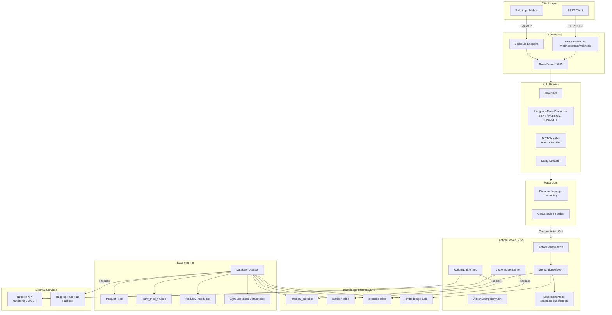
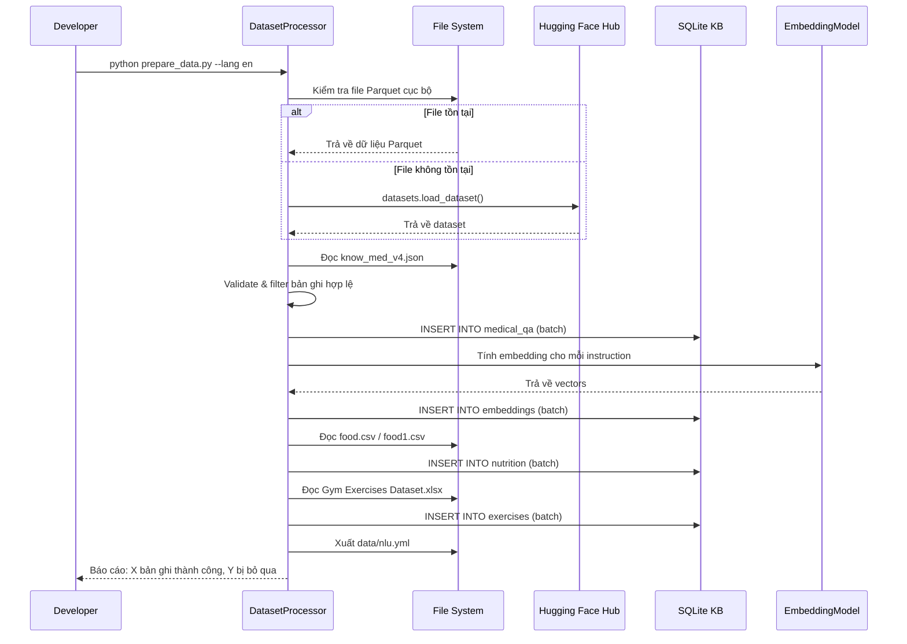
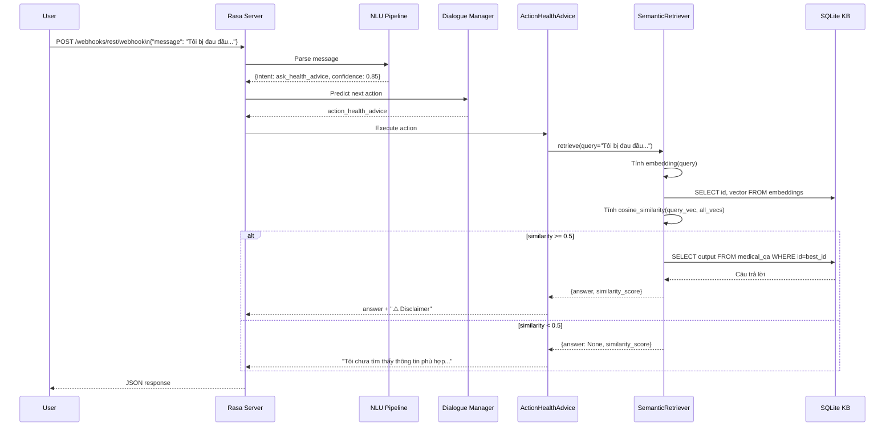
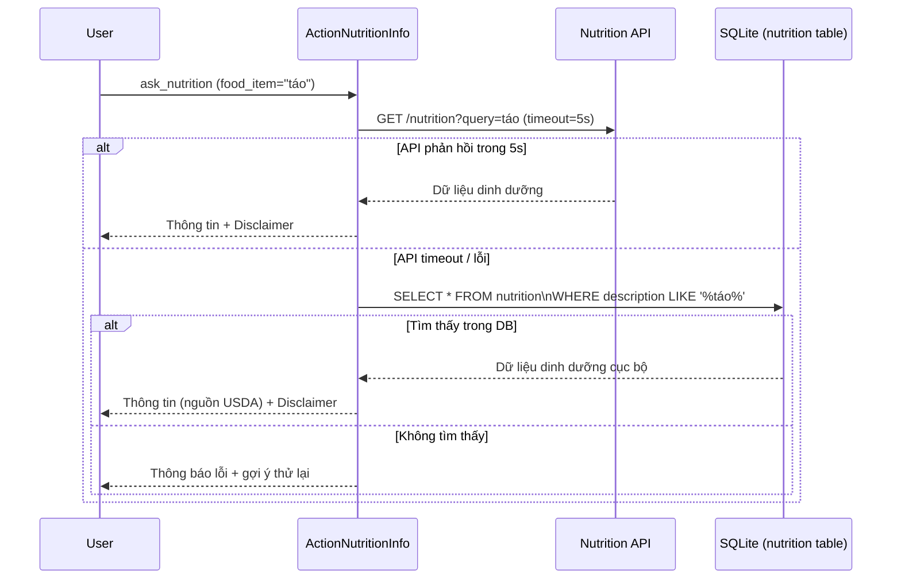

# Tài Liệu Thiết Kế Kỹ Thuật: Health Advice Chatbot

## Tổng Quan

Hệ thống Health Advice Chatbot là một ứng dụng hội thoại thông minh được xây dựng trên nền tảng **Rasa 3.x**, kết hợp với **Semantic Retrieval** dựa trên vector embedding để cung cấp tư vấn sức khỏe, dinh dưỡng và luyện tập. Hệ thống sử dụng dữ liệu từ dataset y tế `knowrohit07/know_medical_dialogue_v2` (file Parquet cục bộ), file `know_med_v4.json`, dữ liệu dinh dưỡng USDA (food.csv/food1.csv) và dữ liệu bài tập (Gym Exercises Dataset.xlsx).

Mọi phản hồi đều kèm theo disclaimer bắt buộc, và hệ thống không đưa ra chẩn đoán hay kê đơn thuốc. Hệ thống hỗ trợ cả tiếng Anh (BERT/RoBERTa) và tiếng Việt (PhoBERT).

---

## Kiến Trúc Tổng Thể



---

## Các Thành Phần Chính và Tương Tác

### 2.1 DatasetProcessor

Module Python chịu trách nhiệm toàn bộ quá trình ETL (Extract-Transform-Load):

- **Nguồn dữ liệu ưu tiên**: 2 file Parquet cục bộ + `know_med_v4.json`
- **Nguồn dự phòng**: Hugging Face Hub (`datasets` library)
- **Đầu ra**: NLU YAML file + Knowledge Base (SQLite)
- **Xử lý lỗi**: Bỏ qua bản ghi thiếu `instruction`/`output`, ghi log cảnh báo
- **Hỗ trợ dịch thuật**: Dịch sang tiếng Việt khi `language=vi`, giữ nguyên bản gốc nếu dịch thất bại

### 2.2 NLU Pipeline

Cấu hình trong `config.yml`:

```
Tokenizer → LanguageModelFeaturizer (BERT/RoBERTa/PhoBERT)
         → CountVectorsFeaturizer
         → DIETClassifier (Intent + Entity)
         → FallbackClassifier (threshold=0.6)
```

**Intents chính**:
- `ask_health_advice` — câu hỏi y tế tổng quát
- `ask_nutrition` — câu hỏi dinh dưỡng
- `ask_exercise` — câu hỏi bài tập
- `emergency` — triệu chứng khẩn cấp
- `greet`, `goodbye`, `nlu_fallback`

**Entities**:
- `food_item` — tên thực phẩm
- `exercise_type` — loại bài tập
- `symptom` — triệu chứng

### 2.3 Rasa Core (Dialogue Manager)

- **Policy**: TEDPolicy + RulePolicy + MemoizationPolicy
- **Stories**: Định nghĩa luồng hội thoại trong `stories.yml`
- **Rules**: Xử lý fallback, emergency, greeting trong `rules.yml`

### 2.4 Action Server

Chạy độc lập tại cổng 5055, gồm các Custom Actions:

| Action | Mô tả |
|--------|-------|
| `ActionHealthAdvice` | Gọi SemanticRetriever, trả về câu trả lời y tế + disclaimer |
| `ActionNutritionInfo` | Gọi Nutrition API → fallback Food CSV |
| `ActionExerciseInfo` | Gọi Nutrition API → fallback Exercise XLSX |
| `ActionEmergencyAlert` | Hiển thị cảnh báo khẩn cấp + số cấp cứu |

### 2.5 SemanticRetriever

Module tìm kiếm ngữ nghĩa:

1. Nhận câu hỏi → tính embedding bằng `sentence-transformers`
2. Tính cosine similarity với tất cả embeddings trong `KB_EMBED`
3. Trả về câu trả lời có similarity cao nhất
4. Nếu similarity < 0.5 → trả về thông báo không tìm thấy

### 2.6 Knowledge Base (SQLite)

Lưu trữ toàn bộ dữ liệu cục bộ, chi tiết ở phần Data Models.

---

## Mô Hình Dữ Liệu (SQLite Schema)

### 3.1 Bảng `medical_qa`

```sql
CREATE TABLE medical_qa (
    id          INTEGER PRIMARY KEY AUTOINCREMENT,
    instruction TEXT    NOT NULL,          -- câu hỏi / instruction gốc
    input       TEXT    DEFAULT '',        -- context bổ sung (có thể rỗng)
    output      TEXT    NOT NULL,          -- câu trả lời
    source      TEXT    NOT NULL,          -- 'parquet', 'json', 'huggingface'
    language    TEXT    DEFAULT 'en',      -- 'en' hoặc 'vi'
    created_at  DATETIME DEFAULT CURRENT_TIMESTAMP
);
```

### 3.2 Bảng `embeddings`

```sql
CREATE TABLE embeddings (
    id          INTEGER PRIMARY KEY,       -- FK → medical_qa.id
    vector      BLOB    NOT NULL,          -- numpy array serialized (float32)
    model_name  TEXT    NOT NULL,          -- tên model tạo embedding
    FOREIGN KEY (id) REFERENCES medical_qa(id) ON DELETE CASCADE
);
```

### 3.3 Bảng `nutrition`

```sql
CREATE TABLE nutrition (
    id              INTEGER PRIMARY KEY AUTOINCREMENT,
    category        TEXT,
    description     TEXT    NOT NULL,      -- tên thực phẩm
    kilocalories    REAL,
    protein_g       REAL,
    carbohydrate_g  REAL,
    fat_total_g     REAL,
    fiber_g         REAL,
    vitamins_json   TEXT,                  -- JSON object cho vitamins
    minerals_json   TEXT,                  -- JSON object cho minerals
    source          TEXT    DEFAULT 'usda' -- 'usda' hoặc 'api'
);

CREATE INDEX idx_nutrition_description ON nutrition(description);
```

### 3.4 Bảng `exercises`

```sql
CREATE TABLE exercises (
    id              INTEGER PRIMARY KEY AUTOINCREMENT,
    name            TEXT    NOT NULL,
    category        TEXT,
    muscle_group    TEXT,
    equipment       TEXT,
    difficulty      TEXT,
    description     TEXT,
    instructions    TEXT
);

CREATE INDEX idx_exercises_name ON exercises(name);
CREATE INDEX idx_exercises_muscle ON exercises(muscle_group);
```

### 3.5 Bảng `conversation_logs`

```sql
CREATE TABLE conversation_logs (
    id              INTEGER PRIMARY KEY AUTOINCREMENT,
    session_id      TEXT    NOT NULL,
    user_message    TEXT    NOT NULL,
    bot_response    TEXT    NOT NULL,
    intent          TEXT,
    confidence      REAL,
    similarity_score REAL,
    timestamp       DATETIME DEFAULT CURRENT_TIMESTAMP
);
```

---

## Luồng Xử Lý Chính (Data Flow)

### 4.1 Luồng Khởi Tạo Dữ Liệu



### 4.2 Luồng Xử Lý Câu Hỏi Y Tế



### 4.3 Luồng Xử Lý Câu Hỏi Dinh Dưỡng (với Fallback)



---

## Cấu Trúc Thư Mục Dự Án

```
MedicalBot/
├── data/
│   ├── nlu.yml                    # Generated by DatasetProcessor
│   ├── stories.yml
│   └── rules.yml
├── dataset/
│   ├── train-00000-of-00002-*.parquet
│   ├── train-00001-of-00002-*.parquet
│   ├── know_med_v4.json
│   ├── food.csv
│   ├── food1.csv
│   └── Gym Exercises Dataset.xlsx
├── actions/
│   ├── __init__.py
│   ├── actions.py                 # Custom Actions (Health, Nutrition, Exercise, Emergency)
│   ├── semantic_retriever.py      # SemanticRetriever class
│   ├── embedding_model.py         # EmbeddingModel wrapper
│   └── db_client.py               # SQLite client
├── scripts/
│   ├── prepare_data.py            # DatasetProcessor entry point
│   └── build_embeddings.py        # Tính và lưu embeddings vào DB
├── knowledge_base/
│   └── health_kb.db               # SQLite database
├── models/                        # Rasa trained models
├── tests/
│   ├── unit/
│   │   ├── test_dataset_processor.py
│   │   ├── test_semantic_retriever.py
│   │   └── test_actions.py
│   └── property/
│       ├── test_pbt_dataset.py
│       ├── test_pbt_retriever.py
│       └── test_pbt_safety.py
├── config.yml                     # Rasa NLU pipeline config
├── domain.yml                     # Intents, entities, slots, responses
├── endpoints.yml                  # Action server endpoint
├── credentials.yml                # REST + Socket.io connectors
└── requirements.txt
```

---

## Correctness Properties

*A property is a characteristic or behavior that should hold true across all valid executions of a system — essentially, a formal statement about what the system should do. Properties serve as the bridge between human-readable specifications and machine-verifiable correctness guarantees.*

### Property 1: Bản ghi hợp lệ được lưu đúng vào Knowledge Base (Round-trip)

*For any* bản ghi có trường `instruction` và `output` không rỗng và không null, sau khi DatasetProcessor xử lý, bản ghi đó phải tồn tại trong bảng `medical_qa` với đúng nội dung `instruction` và `output` — tức là `SELECT instruction, output FROM medical_qa WHERE instruction = ?` phải trả về đúng giá trị ban đầu.

**Validates: Requirements 1.4, 1.5**

---

### Property 2: Bản ghi không hợp lệ không làm tăng kích thước Knowledge Base

*For any* bản ghi có `instruction` hoặc `output` là rỗng hoặc null, số lượng bản ghi trong `medical_qa` trước và sau khi xử lý bản ghi đó phải bằng nhau — DatasetProcessor không được insert bản ghi không hợp lệ.

**Validates: Requirements 1.6**

---

### Property 3: NLU YAML đầu ra luôn có thể parse được

*For any* tập dữ liệu đầu vào hợp lệ (danh sách bản ghi có instruction/output), file `nlu.yml` được tạo ra phải có thể parse bằng `yaml.safe_load()` mà không ném exception, và phải chứa key `nlu` ở cấp cao nhất theo cú pháp Rasa 3.x.

**Validates: Requirements 1.7**

---

### Property 4: Tổng số bản ghi là bất biến

*For any* tập dữ liệu đầu vào, tổng `processed_count + skipped_count` phải bằng đúng tổng số bản ghi đầu vào — không có bản ghi nào bị mất hoặc đếm hai lần.

**Validates: Requirements 1.8**

---

### Property 5: Model ngôn ngữ được chọn đúng theo cấu hình

*For any* cấu hình `language=vi`, tên model được nạp phải là `vinai/phobert-base`; *for any* cấu hình `language=en`, tên model phải là `bert-base-uncased` hoặc `roberta-base` — hai trường hợp này không bao giờ trộn lẫn.

**Validates: Requirements 2.1, 2.2, 5.2**

---

### Property 6: Confidence thấp luôn kích hoạt fallback

*For any* câu hỏi mà Intent_Classifier trả về confidence < 0.6, intent được chọn phải là `nlu_fallback` — không bao giờ là `ask_health_advice`, `ask_nutrition`, hay `ask_exercise`.

**Validates: Requirements 2.3, 2.4**

---

### Property 7: Embedding serialization round-trip

*For any* vector embedding (numpy float32 array có chiều bất kỳ), serialize thành BLOB rồi deserialize lại phải cho ra array có cùng shape và mỗi phần tử sai số < 1e-6 so với giá trị gốc.

**Validates: Requirements 3.1**

---

### Property 8: Retrieval trả về kết quả có similarity cao nhất

*For any* câu hỏi và Knowledge Base không rỗng, câu trả lời được trả về phải có cosine similarity với câu hỏi lớn hơn hoặc bằng similarity của mọi bản ghi khác trong KB.

**Validates: Requirements 3.2**

---

### Property 9: Ngưỡng similarity quyết định nội dung phản hồi

*For any* câu hỏi mà cosine similarity tốt nhất < 0.5, phản hồi phải chứa chuỗi "Tôi chưa tìm thấy thông tin phù hợp"; *for any* câu hỏi mà similarity >= 0.5, phản hồi phải chứa nội dung từ Knowledge Base (không phải thông báo "không tìm thấy").

**Validates: Requirements 3.4**

---

### Property 10: Disclaimer luôn xuất hiện trong mọi phản hồi liên quan sức khỏe

*For any* câu hỏi thuộc intent `ask_health_advice`, `ask_nutrition`, hoặc `ask_exercise` (bất kể nội dung câu hỏi), chuỗi phản hồi cuối cùng phải chứa đúng chuỗi `"⚠️ Thông tin chỉ mang tính chất tham khảo, hãy tham vấn bác sĩ chuyên khoa."`.

**Validates: Requirements 3.5, 4.5, 7.1, 7.2**

---

### Property 11: Fallback cục bộ trả về đầy đủ các trường dinh dưỡng và bài tập

*For any* tên thực phẩm tồn tại trong bảng `nutrition`, khi Nutrition API không phản hồi, dict kết quả trả về phải chứa tất cả các key: `kilocalories`, `protein_g`, `carbohydrate_g`, `fat_total_g`, `fiber_g`. Tương tự, *for any* tên bài tập tồn tại trong bảng `exercises`, kết quả fallback phải chứa ít nhất `name`, `category`, `muscle_group`.

**Validates: Requirements 4.2, 4.3**

---

### Property 12: Không có dữ liệu phù hợp luôn trả về thông báo lỗi (không phải exception)

*For any* câu hỏi mà cả Nutrition API lẫn dữ liệu cục bộ đều không có kết quả, hàm action phải trả về một chuỗi thông báo lỗi không rỗng — không được ném exception hoặc trả về `None`.

**Validates: Requirements 4.4**

---

### Property 13: Dịch thuật thất bại giữ nguyên văn bản gốc

*For any* bản ghi mà hàm dịch thuật ném exception hoặc trả về chuỗi rỗng, giá trị `instruction` và `output` được lưu vào Knowledge Base phải bằng đúng văn bản tiếng Anh gốc — không bị thay thế bằng chuỗi rỗng hay `None`.

**Validates: Requirements 5.4**

---

### Property 14: Cảnh báo khẩn cấp xuất hiện ở đầu phản hồi

*For any* tin nhắn chứa ít nhất một từ khóa khẩn cấp (ví dụ: "đau ngực", "khó thở", "mất ý thức", "chest pain", "shortness of breath"), phần đầu của chuỗi phản hồi (trước ký tự thứ 200) phải chứa số điện thoại cấp cứu "113" hoặc "115" — trước khi có bất kỳ nội dung tư vấn nào.

**Validates: Requirements 7.3**

---

## Xử Lý Lỗi

| Tình huống | Hành vi |
|-----------|---------|
| File Parquet không tồn tại | Fallback sang Hugging Face Hub |
| Bản ghi thiếu `instruction`/`output` | Bỏ qua, ghi log WARNING |
| Nutrition API timeout (>5s) | Fallback sang Food CSV / Exercise XLSX |
| Cả API lẫn local data đều không có | Trả về thông báo lỗi rõ ràng |
| Similarity < 0.5 | Trả về "không tìm thấy thông tin phù hợp" |
| KB không kết nối được khi khởi động | Log lỗi chi tiết, exit code != 0 |
| Dịch thuật thất bại | Giữ nguyên bản gốc, ghi log WARNING |
| Intent confidence < 0.6 | Kích hoạt `nlu_fallback` |

---

## Chiến Lược Kiểm Thử

### Unit Tests

Tập trung vào các ví dụ cụ thể, edge cases và điều kiện lỗi:

- `test_dataset_processor.py`: Kiểm tra xử lý bản ghi hợp lệ/không hợp lệ, đọc từng nguồn dữ liệu, xuất YAML
- `test_semantic_retriever.py`: Kiểm tra cosine similarity, ngưỡng 0.5, trường hợp KB rỗng
- `test_actions.py`: Kiểm tra disclaimer, emergency alert, fallback logic

### Property-Based Tests

Sử dụng thư viện **Hypothesis** (Python) với tối thiểu 100 iterations mỗi property.

Mỗi test phải có comment tag theo định dạng:
`# Feature: health-advice-chatbot, Property {N}: {property_text}`

| Property | Test File | Pattern |
|----------|-----------|---------|
| P1: Bản ghi hợp lệ lưu vào KB | `test_pbt_dataset.py` | Round-trip |
| P2: Bản ghi không hợp lệ không tăng KB | `test_pbt_dataset.py` | Invariant |
| P3: NLU YAML có thể parse được | `test_pbt_dataset.py` | Round-trip (parse) |
| P4: Tổng bản ghi là bất biến | `test_pbt_dataset.py` | Invariant |
| P5: Model đúng theo ngôn ngữ | `test_pbt_dataset.py` | Invariant |
| P6: Confidence thấp → fallback | `test_pbt_retriever.py` | Metamorphic |
| P7: Embedding serialization round-trip | `test_pbt_retriever.py` | Round-trip |
| P8: Retrieval trả về similarity cao nhất | `test_pbt_retriever.py` | Metamorphic |
| P9: Ngưỡng similarity quyết định phản hồi | `test_pbt_retriever.py` | Invariant |
| P10: Disclaimer luôn có mặt | `test_pbt_safety.py` | Invariant |
| P11: Fallback trả về đủ trường | `test_pbt_retriever.py` | Invariant |
| P12: Không có dữ liệu → thông báo lỗi | `test_pbt_retriever.py` | Error condition |
| P13: Dịch thất bại giữ bản gốc | `test_pbt_dataset.py` | Error condition |
| P14: Cảnh báo khẩn cấp ở đầu phản hồi | `test_pbt_safety.py` | Invariant |

**Cấu hình Hypothesis**:
```python
from hypothesis import given, settings, HealthCheck
from hypothesis import strategies as st

@settings(max_examples=100, suppress_health_check=[HealthCheck.too_slow])
@given(...)
def test_property_N(...):
    # Feature: health-advice-chatbot, Property N: <property_text>
    ...
```
