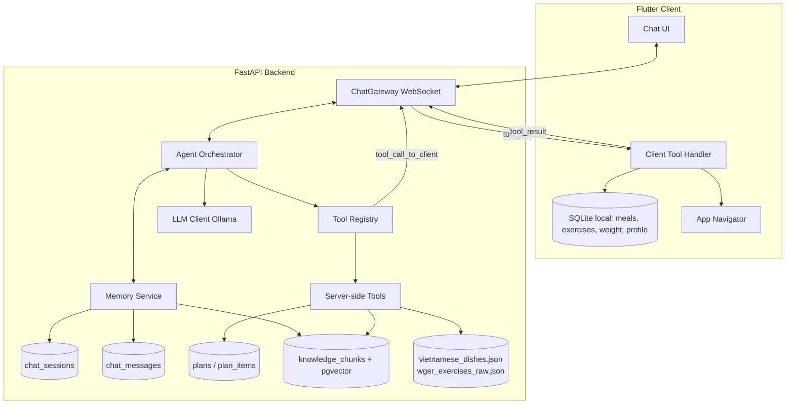
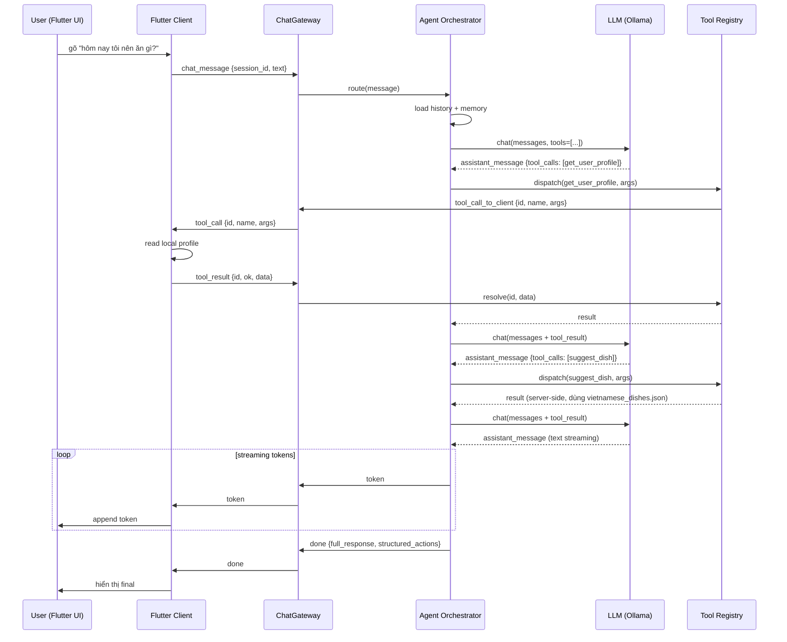
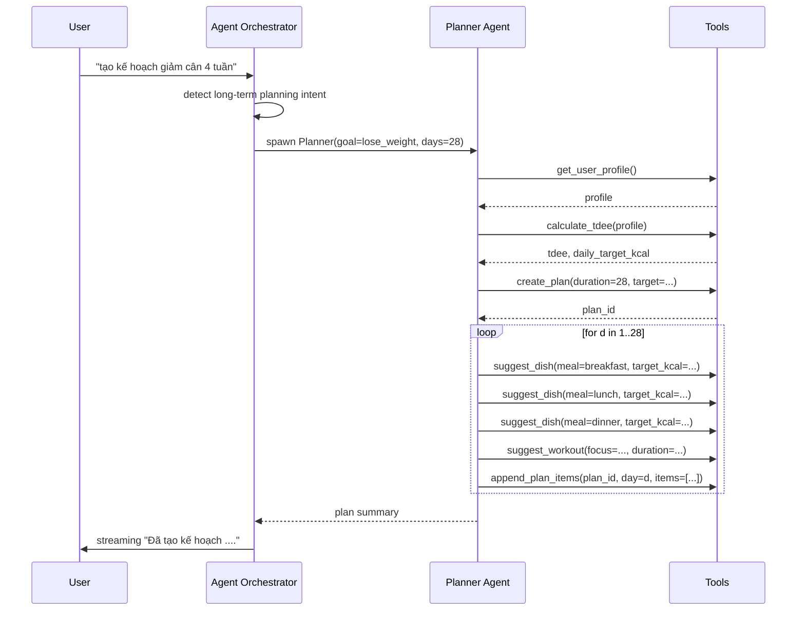

# Design Document: Chatbot Redesign

> Ngôn ngữ: Tiếng Việt (theo yêu cầu người dùng).
> Style: Pseudocode chính (Structured Pseudocode) + Python typed cho ví dụ backend, Dart cho ví dụ client. Backend stack hiện tại là FastAPI nên các đoạn cài đặt minh họa dùng Python, nhưng pseudocode trong "Algorithmic Pseudocode" cố tình giữ trung tính ngôn ngữ.

---

## Overview

Thiết kế lại toàn bộ chatbot trong HealthApp theo kiến trúc **agent có công cụ (tool-using agent)**. Chatbot không còn là một module rời rạc gọi vài endpoint, mà trở thành một orchestrator duy nhất:

- Hiểu ý định người dùng bằng LLM (không còn keyword routing cứng).
- Truy xuất và ghi dữ liệu user trong app thông qua một tập **tool chuẩn hóa**, một số tool chạy ở backend, một số tool chạy ngược về Flutter client qua WebSocket.
- Lập kế hoạch dài hạn (nhiều tuần) bằng cách phân rã thành nhiều bước tool call có kiểm chứng được.
- Có long-term memory: lịch sử hội thoại, sự kiện đáng nhớ về user, kế hoạch active.

Mục tiêu là tạo trải nghiệm hội thoại tự nhiên, có khả năng "làm việc" thật trên dữ liệu của user thay vì chỉ "gợi ý chung chung", đồng thời giảm số module fragmented (`intent_classifier`, `conversation_flow`, `prompt_builder`, `ai_analyzer`, `response_parser`, `user_state`, ...) về một loop duy nhất.

## Mục tiêu thiết kế và phạm vi thay đổi

### 2.1 Pain points cần giải quyết

| Vấn đề người dùng nêu | Nguyên nhân kỹ thuật trong code hiện tại | Cách thiết kế mới giải quyết |
|---|---|---|
| Chatbot và app rời rạc | Flutter chỉ gửi snapshot `UserContext` mỗi request, backend không thể đọc/ghi state app | Bidirectional WebSocket: backend phát `tool_call` ngược về Flutter, Flutter trả `tool_result` |
| Không tạo được kế hoạch dài hạn | `routers/plans.py` chỉ lưu metadata kế hoạch, item rỗng (`'{"focus":"balanced"}'`) | `Planner` agent dùng tool `suggest_dish` / `suggest_workout` lặp theo ngày, lưu vào `plan_items` với payload đầy đủ |
| NLP yếu, response không tự nhiên | `intent_classifier.py` regex; `prompt_builder.py` >1000 dòng template cứng; LLM không có function calling | Một system prompt ngắn + tool schema; LLM tự quyết tool gọi |
| Không truy xuất data user | Không có cơ chế đọc data ngoài `UserContext` snapshot | Tool catalog: `get_meal_log_range`, `get_weight_history`, `get_active_plan`, ... |
| Không tương tác toàn bộ chức năng | Chỉ có `dish_optimizer`, `exercise_optimizer` được trigger gián tiếp | Tool catalog phản chiếu các chức năng app: `log_meal`, `log_exercise`, `update_plan_item`, `navigate_to_screen` |
| Không tối ưu | Mỗi request rebuild prompt lớn, không cache, nhiều service singleton load lại | LLM streaming + tool dispatch, mỗi tool nhanh và idempotent |

### 2.2 Phạm vi rewrite

**Đập đi:** toàn bộ `services/*.py` và `routers/chat.py`. Cụ thể:
`ai_analyzer.py`, `conversation_flow.py`, `intent_classifier.py`, `prompt_builder.py`, `response_parser.py`, `user_state.py`, `dish_optimizer.py`, `meal_optimizer.py`, `exercise_optimizer.py`, `wger_search.py`, `wger_service.py`, `ingredient_translator.py`, `tdee_calculator.py` (logic tính TDEE sẽ viết lại nhỏ hơn bên trong tool).

**Giữ lại làm dữ liệu/hạ tầng (KHÔNG phải code logic):**
- `db/init.sql` — schema cũ (`chat_sessions`, `chat_messages`, `plans`, `plan_items`, `knowledge_chunks`, `chunk_embeddings`, `wger_exercises`, `wger_ingredients`) sẽ được mở rộng, không drop.
- `data/vietnamese_dishes.json`, `data/vietnamese_foods.json`, `data/wger_exercises_raw.json`, `data/exercises.json`, `data/nutrition.json` — là dữ liệu, không phải code.
- `config.py` — đổi tên model mặc định, giữ nguyên cấu trúc.
- `main.py` — đổi router `chat`, giữ phần FastAPI lifespan.
- `routers/nutrition.py`, `routers/off.py`, `routers/wger.py`, `routers/plans.py` — vẫn cần cho HTTP API (nhưng `plans.py` sẽ được refactor để Planner agent dùng).

**Tradeoff đã thảo luận với người dùng (Karpathy: surface tradeoffs):**
- WebSocket bidirectional khó hơn HTTP một chiều: cần correlation_id, timeout per tool call, xử lý mất kết nối khi tool đang pending. Lợi: Flutter là source-of-truth, không cần đồng bộ DB hai chiều.
- Đập toàn bộ services có rủi ro mất các bug-fix tích lũy (đặc biệt `response_parser._is_garbled`, `_strip_suggestions`). Giảm thiểu: kiến trúc mới không sinh `[ACTION_DATA]` block trong text — output có cấu trúc đến từ LLM function calling, không cần parser regex.
- Ollama + qwen2.5:7b: function calling chất lượng tốt nhưng phụ thuộc đúng template. Có fallback "structured-output mode" (model trả JSON theo schema) khi function calling gốc của model không ổn định.

### 2.3 Tiêu chí thành công có thể kiểm chứng (Karpathy: define verifiable success criteria)

1. Một câu hỏi tiếng Việt tự nhiên ("hôm qua tôi ăn gì có đủ protein không?") được trả lời đúng dựa trên `meal_log` thực tế của user, không bịa số.
2. Yêu cầu "tạo kế hoạch giảm cân 4 tuần" → backend tạo `plan` với `duration_days=28`, mỗi `plan_item` có payload đầy đủ (món ăn cụ thể, bài tập cụ thể), tổng kcal mỗi ngày khớp với target ±10%.
3. Yêu cầu "ghi lại bữa trưa hôm nay là cơm gà 500 kcal" → chatbot phát `tool_call: log_meal`, Flutter ghi vào local DB và `tool_result` thành công, chatbot xác nhận bằng câu nói tự nhiên.
4. Property test: với mọi `tool_call` backend gửi, mỗi `tool_call` có `correlation_id` duy nhất và phải khớp với đúng một `tool_result`. Không có orphan call.
5. Property test: với mọi plan đã tạo, `sum(plan_items.target_kcal where item_type='meal' and day_index=d)` ≈ `plan.daily_kcal_target` cho mọi `d`.
6. Property test: agent loop dừng trong ≤ `MAX_AGENT_STEPS` bước (mặc định 6) cho mọi input. Không vòng lặp vô hạn.

---

## Architecture

### 3.1 Sơ đồ thành phần



### 3.2 Sơ đồ tuần tự — luồng chat một câu hỏi đơn giản



### 3.3 Sơ đồ tuần tự — tạo kế hoạch dài hạn 4 tuần



---

## Components and Interfaces

### 4.1 ChatGateway (WebSocket)
- Endpoint: `WS /chat/stream` (giữ path cũ để Flutter ít thay đổi).
- Trách nhiệm:
  - Nhận message client (`chat_message`, `tool_result`).
  - Phát message server (`token`, `done`, `tool_call`, `error`).
  - Mỗi connection liên kết 1 session_id, không multiplex nhiều session.
- Không chứa logic LLM hoặc tool dispatch. Chỉ là transport + protocol.

### 4.2 Agent Orchestrator
- Một class `AgentOrchestrator` triển khai vòng lặp ReAct (Reason + Act).
- Mỗi turn:
  1. Load lịch sử + summary memory.
  2. Gọi LLM với danh sách tool schema.
  3. Nếu LLM yêu cầu tool_calls → dispatch lần lượt qua `ToolRegistry`.
  4. Lặp tới khi LLM trả `assistant_message` không kèm tool_call hoặc đạt `MAX_AGENT_STEPS`.
- Có timeout tổng thể (`AGENT_TIMEOUT_SECONDS`) và per-tool timeout.

### 4.3 ToolRegistry và ToolDispatcher
- `ToolRegistry`: map `tool_name -> ToolDescriptor` với JSON schema, side (server/client), timeout, idempotency flag.
- `ToolDispatcher`: nhận `tool_call`, validate args theo schema, gọi đúng implementation:
  - Server tool → call function trực tiếp.
  - Client tool → push qua `ChatGateway.send_tool_call()`, await `tool_result` qua `Future` map theo `correlation_id`.

### 4.4 LLM Client
- Wrapper Ollama HTTP `/api/chat` với `tools=[...]` (function calling format chuẩn của Ollama 0.4+).
- Hỗ trợ streaming và tool_call detection.
- Có fallback "JSON-mode": nếu model trả prose thay vì tool_call, parse một block `<tool_call>{...}</tool_call>` cuối cùng.

### 4.5 Memory Service
- Lưu trữ:
  - Lịch sử raw turn (`chat_messages`).
  - Summary tóm tắt mỗi N turn (rolling summary).
  - "Pinned facts" về user (sở thích ăn uống, dị ứng, mục tiêu) lấy ra từ hội thoại và confirm với user.
- Truy xuất hybrid: lịch sử N turn cuối + RAG (top-k chunk knowledge gắn với câu hỏi).

### 4.6 Server-side Tools
- `suggest_dish(meal_type, target_kcal, dietary_restrictions, recent_dish_ids) -> Dish`
  - Reimplement nhỏ gọn từ logic cũ `dish_optimizer.py`, đọc `vietnamese_dishes.json`.
- `suggest_workout(muscle_group, duration_min, equipment, level) -> WorkoutPlan`
  - Reimplement từ `exercise_optimizer.py`, đọc `wger_exercises_raw.json`.
- `calculate_tdee(profile) -> {bmr, tdee, daily_kcal}`
- `search_food_nutrition(query) -> [Food]` (đọc `vietnamese_foods.json` + RAG cho tương tự).
- `create_plan(user_id, goal, duration_days, daily_kcal_target) -> plan_id`
- `append_plan_items(plan_id, day_index, items) -> void`
- `query_rag(query, top_k) -> [KnowledgeChunk]`

### 4.7 Client-side Tools (chạy trên Flutter)
- `get_user_profile() -> UserProfile`
- `get_today_meals() -> [Meal]`
- `get_today_exercises() -> [Exercise]`
- `get_meal_log_range(from_date, to_date) -> [Meal]`
- `get_exercise_log_range(from_date, to_date) -> [Exercise]`
- `get_weight_history(days) -> [WeightEntry]`
- `log_meal(meal_type, dish_name, components) -> {ok}`
- `log_exercise(exercise_name, duration_min, calories_burned) -> {ok}`
- `log_weight(value_kg, date) -> {ok}`
- `get_active_plan() -> Plan | null`
- `mark_plan_item_complete(item_id) -> {ok}`
- `navigate_to_screen(screen, params) -> {ok}` (mở màn hình tương ứng trong app)

---

## Tool Catalog

Mỗi tool tuân theo OpenAI/Ollama function calling schema. Bảng tóm tắt:

| Tên tool | Side | Mục đích | Idempotent |
|---|---|---|---|
| `get_user_profile` | client | đọc profile (age, height, weight, goal) | yes |
| `get_today_meals` | client | bữa ăn đã ghi hôm nay | yes |
| `get_today_exercises` | client | bài tập đã ghi hôm nay | yes |
| `get_meal_log_range` | client | đọc nhật ký ăn uống theo ngày | yes |
| `get_exercise_log_range` | client | đọc nhật ký tập | yes |
| `get_weight_history` | client | đọc cân nặng theo thời gian | yes |
| `get_active_plan` | client | đọc kế hoạch đang chạy | yes |
| `log_meal` | client | ghi bữa ăn | no (write) |
| `log_exercise` | client | ghi bài tập | no |
| `log_weight` | client | ghi cân nặng | no |
| `mark_plan_item_complete` | client | đánh dấu hoàn thành | no |
| `navigate_to_screen` | client | điều hướng UI | no (side effect) |
| `suggest_dish` | server | gợi ý món Việt theo macro | yes |
| `suggest_workout` | server | gợi ý buổi tập theo nhóm cơ | yes |
| `calculate_tdee` | server | tính BMR/TDEE | yes |
| `search_food_nutrition` | server | tra cứu dinh dưỡng | yes |
| `create_plan` | server | tạo plan record | no |
| `append_plan_items` | server | thêm item vào plan | no |
| `query_rag` | server | tìm chunks kiến thức | yes |

Quy ước: write tool (idempotent=false) phải trả `request_id` và backend chấp nhận retry idempotent qua `request_id`.

---

## Data Models

### 6.1 Type definitions (Pseudocode trung tính)

```pascal
STRUCTURE UserProfile
  user_id: String
  age: Integer (10..120)
  gender: Enum {male, female}
  height_cm: Float (100..250)
  weight_kg: Float (30..300)
  activity_level: Enum {sedentary, light, moderate, active, very_active}
  health_goal: Enum {lose_weight, maintain, gain_muscle}
  dietary_restrictions: List[String]   // ví dụ: ["vegetarian"]
END STRUCTURE

STRUCTURE Meal
  id: UUID
  user_id: String
  meal_date: Date
  meal_type: Enum {breakfast, lunch, dinner, snack}
  dish_name: String
  components: List[FoodComponent]
  total_calories: Float
  total_protein: Float
  total_carbs: Float
  total_fat: Float
  logged_at: Timestamp
END STRUCTURE

STRUCTURE FoodComponent
  name: String
  serving_grams: Integer
  calories: Float
  protein: Float
  carbs: Float
  fat: Float
END STRUCTURE

STRUCTURE Exercise
  id: UUID
  user_id: String
  exercise_date: Date
  name: String
  category: String
  duration_minutes: Integer
  calories_burned: Float
  sets: Integer | Null
  reps: String | Null
  logged_at: Timestamp
END STRUCTURE

STRUCTURE WeightEntry
  user_id: String
  measured_on: Date
  weight_kg: Float
END STRUCTURE

STRUCTURE Plan
  id: UUID
  user_id: String
  goal: String
  start_date: Date
  end_date: Date
  duration_days: Integer (3..120)
  daily_kcal_target: Float
  daily_protein_target: Float
  status: Enum {active, completed, cancelled}
  created_at: Timestamp
END STRUCTURE

STRUCTURE PlanItem
  id: UUID
  plan_id: UUID
  day_index: Integer (1..duration_days)
  plan_date: Date
  item_type: Enum {meal, exercise}
  title: String
  payload: Json   // có cấu trúc ở §6.2
  target_kcal: Float | Null
  target_protein: Float | Null
  completed: Boolean
END STRUCTURE

STRUCTURE ChatTurn
  id: UUID
  session_id: UUID
  role: Enum {user, assistant, tool}
  content: String                       // text cho user/assistant; JSON cho tool
  tool_call_id: String | Null           // chỉ có khi role = tool
  tool_name: String | Null
  created_at: Timestamp
END STRUCTURE
```

### 6.2 Plan item payload

```pascal
STRUCTURE MealPlanPayload         // payload khi item_type = meal
  meal_type: Enum {breakfast, lunch, dinner, snack}
  dish_name: String
  components: List[FoodComponent]
END STRUCTURE

STRUCTURE ExercisePlanPayload     // payload khi item_type = exercise
  workout_title: String
  exercises: List[ExerciseItem]
  total_duration_minutes: Integer
  total_calories_burned: Float
END STRUCTURE

STRUCTURE ExerciseItem
  name: String
  category: String
  duration_minutes: Integer
  sets: Integer
  reps: String
  calories_burned: Float
END STRUCTURE
```

### 6.3 Validation rules

- `Plan.end_date - Plan.start_date + 1 == Plan.duration_days`.
- `PlanItem.day_index ∈ [1, Plan.duration_days]`, `PlanItem.plan_date == Plan.start_date + (day_index - 1)`.
- Với mỗi `(plan_id, day_index)`: ít nhất 3 `MealPlanPayload` (sáng/trưa/tối) hoặc 0 (rest day chỉ với exercise).
- `Meal.total_calories == sum(components[i].calories)` ± 1 kcal.

---

## Giao thức WebSocket

### 7.1 Tin nhắn từ Client → Server

```pascal
MESSAGE chat_message
  type: "chat_message"
  session_id: String
  message: String
END MESSAGE

MESSAGE tool_result
  type: "tool_result"
  session_id: String
  correlation_id: String        // khớp với tool_call.id từ server
  ok: Boolean
  data: Json | Null             // khi ok = true
  error: { code: String, message: String } | Null   // khi ok = false
END MESSAGE
```

### 7.2 Tin nhắn từ Server → Client

```pascal
MESSAGE token
  type: "token"
  content: String
END MESSAGE

MESSAGE tool_call
  type: "tool_call"
  correlation_id: String
  name: String
  arguments: Json
  timeout_ms: Integer
END MESSAGE

MESSAGE done
  type: "done"
  full_response: String
  // Optional: structured danh sách thao tác đã thực hiện trong turn
  performed_actions: List[{ tool: String, args: Json, result_summary: String }]
END MESSAGE

MESSAGE error
  type: "error"
  code: String
  message: String
END MESSAGE
```

### 7.3 Quy tắc protocol

- Mỗi `tool_call` server gửi đi PHẢI nhận `tool_result` có cùng `correlation_id` trong `timeout_ms`. Nếu quá hạn → orchestrator xử lý như tool fail.
- Client KHÔNG được gửi `tool_result` nếu không có `tool_call` tương ứng (server bỏ qua + log).
- Trong cùng một turn (giữa `chat_message` và `done`) có thể có nhiều cặp `tool_call`/`tool_result`.

---

## Algorithmic Pseudocode

### 8.1 Vòng lặp Agent

```pascal
ALGORITHM handleChatMessage(session_id, user_text)
INPUT:  session_id String, user_text String
OUTPUT: streamed tokens và một done event qua WebSocket

PRECONDITION:
  - session_id thuộc về một WebSocket connection đang mở
  - user_text non-empty

POSTCONDITION:
  - chat_messages có thêm 1 turn role=user và ≥1 turn role=assistant
  - Mọi tool_call được phát ra đều đã nhận tool_result hoặc đã timeout
  - Không có tool_call orphan (một correlation_id chỉ xuất hiện đúng một lần)

BEGIN
  // 1. Load context
  history       ← sessionStore.loadRecentTurns(session_id, MAX_HISTORY)
  summary       ← memoryService.getRollingSummary(session_id)
  pinned_facts  ← memoryService.getPinnedFacts(session_id)
  rag_chunks    ← memoryService.queryRag(user_text, top_k = 4)

  // 2. Build initial messages cho LLM
  messages ← [
    systemMessage(buildSystemPrompt(summary, pinned_facts, rag_chunks)),
    ...history,
    userMessage(user_text)
  ]
  sessionStore.appendTurn(session_id, role=user, content=user_text)

  // 3. Agent loop (ReAct)
  step ← 0
  WHILE step < MAX_AGENT_STEPS DO
    step ← step + 1

    response ← LLMClient.chat(messages, tools = ToolRegistry.schemas())

    IF response.tool_calls is empty THEN
      // LLM kết thúc, stream final response
      streamTokensToClient(response.content_stream)
      sessionStore.appendTurn(session_id, role=assistant,
                              content=response.full_text)
      sendDone(session_id, response.full_text, performed_actions)
      RETURN
    END IF

    // 4. Có tool_call → dispatch
    tool_results ← []
    FOR each call IN response.tool_calls DO
      ASSERT call.id is unique within this turn
      result ← ToolDispatcher.dispatch(session_id, call,
                                       timeout_ms = TOOL_TIMEOUT)
      sessionStore.appendTurn(session_id, role=tool,
                              tool_call_id=call.id,
                              tool_name=call.name,
                              content=serialize(result))
      tool_results.append((call.id, result))
      performed_actions.append((call.name, call.arguments,
                                summarize(result)))
    END FOR

    // 5. Inject tool_results vào message stream và lặp lại
    messages.append(assistantMessage(tool_calls = response.tool_calls))
    FOR (id, result) IN tool_results DO
      messages.append(toolMessage(id, result))
    END FOR
  END WHILE

  // 6. Hết MAX_AGENT_STEPS → trả lời thẳng
  sendError(session_id, code = "AGENT_LOOP_EXCEEDED",
            message = "Câu hỏi quá phức tạp, vui lòng chia nhỏ.")
END
```

**Loop invariants:**
- Mọi `correlation_id` trong các vòng lặp đều unique trong phạm vi turn.
- Số phần tử mới thêm vào `chat_messages` mỗi vòng lặp = 1 (assistant) + |tool_calls| (tool turns).
- `step ≤ MAX_AGENT_STEPS` luôn đúng khi vào nhánh dispatch.

### 8.2 Tool Dispatcher

```pascal
ALGORITHM dispatch(session_id, call, timeout_ms)
INPUT:  session_id String, call ToolCall, timeout_ms Integer
OUTPUT: ToolResult { ok: Boolean, data: Any, error: String|Null }

PRECONDITION:
  - call.name có trong ToolRegistry
  - call.arguments khớp JSON schema của tool
  - call.id unique trong turn hiện tại

POSTCONDITION:
  - Trả về kết quả trong ≤ timeout_ms hoặc trả về ToolResult{ok=false, error="TIMEOUT"}
  - Không bao giờ raise exception ra ngoài (mọi lỗi được encapsulate)

BEGIN
  descriptor ← ToolRegistry.get(call.name)

  // Validate args
  IF NOT validateAgainstSchema(call.arguments, descriptor.schema) THEN
    RETURN ToolResult(ok=false, error="INVALID_ARGS")
  END IF

  TRY
    IF descriptor.side = "server" THEN
      // Run server-side, có timeout
      data ← runWithTimeout(descriptor.fn(call.arguments), timeout_ms)
      RETURN ToolResult(ok=true, data=data)
    ELSE  // descriptor.side = "client"
      // Phát tool_call qua WebSocket, await tool_result
      future ← pendingCalls.register(call.id, timeout_ms)
      ChatGateway.send(session_id, toolCallEnvelope(call, timeout_ms))
      result ← AWAIT future       // resolve khi nhận tool_result, reject khi timeout
      RETURN result
    END IF
  CATCH timeoutException
    pendingCalls.remove(call.id)
    RETURN ToolResult(ok=false, error="TIMEOUT")
  CATCH any other exception e
    log e
    RETURN ToolResult(ok=false, error="TOOL_INTERNAL_ERROR")
  END TRY
END
```

### 8.3 Planner (long-term plan)

```pascal
ALGORITHM createLongTermPlan(user_id, goal, duration_days, profile)
INPUT:  user_id String, goal Enum, duration_days Integer (3..120), profile UserProfile
OUTPUT: plan_id String

PRECONDITION:
  - profile được load hợp lệ qua tool get_user_profile
  - duration_days ∈ [3, 120]

POSTCONDITION:
  - 1 row mới trong plans với status = "active"
  - Đúng (3 + 1) plan_items per day cho mỗi day ∈ [1, duration_days]
    (3 meals + 1 exercise hoặc 0 exercise vào rest day)
  - sum(plan_items.target_kcal where item_type=meal, day=d) ∈ daily_kcal_target ± 10%

BEGIN
  ASSERT 3 ≤ duration_days ≤ 120

  metrics ← Tools.calculate_tdee(profile)
  daily_kcal ← metrics.daily_kcal
  daily_protein ← protein_target_for_goal(profile.weight_kg, goal)

  plan_id ← Tools.create_plan(user_id, goal, duration_days, daily_kcal,
                              daily_protein)

  recent_dish_ids ← []
  FOR d IN 1..duration_days DO
    ASSERT planContainsExactDays(plan_id, expected = d - 1)   // invariant

    items ← []

    breakfast ← Tools.suggest_dish(meal_type="breakfast",
                                   target_kcal = daily_kcal * 0.30,
                                   recent_dish_ids = recent_dish_ids)
    lunch     ← Tools.suggest_dish(meal_type="lunch",
                                   target_kcal = daily_kcal * 0.40,
                                   recent_dish_ids = recent_dish_ids)
    dinner    ← Tools.suggest_dish(meal_type="dinner",
                                   target_kcal = daily_kcal * 0.30,
                                   recent_dish_ids = recent_dish_ids)

    recent_dish_ids ← lastN(recent_dish_ids ++ [breakfast.id, lunch.id, dinner.id], N=6)

    items.append(toMealItem(d, breakfast))
    items.append(toMealItem(d, lunch))
    items.append(toMealItem(d, dinner))

    IF NOT isRestDay(d, goal) THEN
      workout ← Tools.suggest_workout(focus = pickFocus(d, goal),
                                       duration_min = pickDuration(goal),
                                       equipment = profile.equipment_default,
                                       level = profile.fitness_level)
      items.append(toExerciseItem(d, workout))
    END IF

    Tools.append_plan_items(plan_id, day_index = d, items = items)

    // POSTCONDITION cho mỗi vòng lặp:
    ASSERT |loaded_plan_items_for(plan_id, day=d, type=meal)| = 3
    ASSERT sumKcal(loaded_plan_items_for(plan_id, day=d, type=meal))
           BETWEEN daily_kcal * 0.9 AND daily_kcal * 1.1
  END FOR

  RETURN plan_id
END
```

**Loop invariants:**
- Sau khi vòng lặp xử lý xong day `d`, số `plan_items` thuộc plan có `day_index ≤ d` đúng `d * 3 + (số non-rest day ≤ d)`.
- `recent_dish_ids` có kích thước tối đa 6.

### 8.4 Memory rolling summary

```pascal
ALGORITHM updateRollingSummary(session_id, new_turns)
INPUT:  session_id, new_turns: List[ChatTurn]
OUTPUT: Void (cập nhật memory)

PRECONDITION:
  - new_turns là các turn vừa append vào session

POSTCONDITION:
  - Nếu len(history) > SUMMARY_THRESHOLD: rolling_summary được cập nhật để cô đặc các turn cũ
  - Pinned facts mới (nếu LLM đề xuất) được đề nghị cho user xác nhận

BEGIN
  total ← sessionStore.countTurns(session_id)
  IF total ≤ SUMMARY_THRESHOLD THEN RETURN

  old_turns ← sessionStore.loadOldTurns(session_id,
                  before = total - KEEP_RAW_TURNS)
  summary_prompt ← buildSummaryPrompt(old_turns, current_summary)
  new_summary ← LLMClient.complete(summary_prompt)
  memoryService.saveRollingSummary(session_id, new_summary)

  candidate_facts ← extractFactCandidates(old_turns)
  FOR fact IN candidate_facts DO
    IF NOT memoryService.hasFact(session_id, fact) THEN
      memoryService.proposeFact(session_id, fact)
    END IF
  END FOR
END
```

---

## Key Functions with Formal Specifications

### 9.1 `LLMClient.chat`

```python
async def chat(
    self,
    messages: list[Message],
    tools: list[ToolSchema],
    stream: bool = True,
) -> LLMResponse:
    """
    Gọi Ollama /api/chat với function calling.
    """
```

**Preconditions:**
- `messages` non-empty và phần tử cuối là role `user` hoặc `tool`.
- Mỗi `tools[i]` có `name`, `description`, `parameters` (JSON Schema).
- Ollama health check trước đó đã OK ít nhất một lần trong session.

**Postconditions:**
- Trả `LLMResponse(tool_calls, content_stream, full_text)`. Khi `tool_calls` non-empty thì `content_stream` rỗng.
- Mọi `tool_call.id` trong response unique.
- Nếu Ollama trả output garbled (≥ 30% ký tự không hợp lệ), raise `GarbledOutputError`.

**Loop invariants:** N/A (không có vòng lặp ở tầng này, vòng lặp nằm ở orchestrator).

### 9.2 `ToolRegistry.register` và `validate`

```python
def register(self, descriptor: ToolDescriptor) -> None: ...
def schemas(self) -> list[ToolSchema]: ...
def validate(self, name: str, args: dict) -> tuple[bool, str | None]: ...
```

**Preconditions:**
- `descriptor.name` chưa tồn tại trong registry khi gọi `register`.
- `descriptor.schema` là JSON Schema hợp lệ (có `type`, `properties`).

**Postconditions:**
- Sau `register(d)`: `schemas()` chứa schema của `d`; `validate(d.name, args)` trả về `(True, None)` nếu args khớp.
- `validate(unknown_name, _)` luôn trả `(False, "UNKNOWN_TOOL")`.

### 9.3 `ChatGateway.send_tool_call`

```python
async def send_tool_call(
    self,
    session_id: str,
    call: ToolCall,
    timeout_ms: int,
) -> ToolResult: ...
```

**Preconditions:**
- WebSocket cho `session_id` đang mở.
- `call.id` unique trong turn hiện tại.

**Postconditions:**
- Return về `ToolResult` trong tối đa `timeout_ms + JITTER` ms.
- Nếu WebSocket disconnect trong khi pending: return `ToolResult(ok=False, error="DISCONNECTED")`, future được clean up.
- Sau khi return, không có entry `call.id` còn trong `pendingCalls`.

### 9.4 `Tools.suggest_dish`

```python
def suggest_dish(
    meal_type: Literal["breakfast", "lunch", "dinner", "snack"],
    target_kcal: float,
    dietary_restrictions: list[str] = (),
    recent_dish_ids: list[int] = (),
) -> Dish: ...
```

**Preconditions:**
- `target_kcal > 0`.
- `dietary_restrictions ⊆ {"vegetarian", "vegan", "low_carb", "high_protein", "no_seafood"}`.

**Postconditions:**
- Trả `Dish` với `meal_type ∈ dish.meal_types` của bản gốc trong `vietnamese_dishes.json`.
- `dish.id ∉ recent_dish_ids` nếu tồn tại ít nhất một dish khác phù hợp.
- `0.7 * target_kcal ≤ dish.total_calories ≤ 1.5 * target_kcal` (sau khi scale).
- Mọi `component.serving_grams ≥ 1`.

### 9.5 `Tools.suggest_workout`

```python
def suggest_workout(
    muscle_group: str,
    duration_min: int,
    equipment: str,
    level: Literal["beginner", "intermediate", "advanced"],
    user_state: UserStateSnapshot | None = None,
) -> WorkoutPlan: ...
```

**Preconditions:**
- `duration_min ∈ [10, 120]`.
- `muscle_group ∈ {"full_body", "chest", "back", "legs", "shoulders", "arms", "abs", "cardio"}`.

**Postconditions:**
- `len(plan.exercises) ∈ [2, 8]`.
- `sum(ex.duration_minutes) ≤ duration_min`.
- Khi `equipment = "none"`: mọi `ex.equipment` rỗng.
- Khi `user_state.fatigue_level ∈ {"high", "very_high"}`: `level` được hạ 1 nấc (advanced→intermediate→beginner).

### 9.6 `MemoryService.queryRag`

```python
async def queryRag(query: str, top_k: int) -> list[KnowledgeChunk]: ...
```

**Preconditions:**
- `query` non-empty, `top_k > 0`.
- `chunk_embeddings` đã có ít nhất 1 row (nếu rỗng → trả `[]`).

**Postconditions:**
- `len(result) ≤ top_k`.
- Mọi `chunk.similarity ≥ RAG_SIMILARITY_THRESHOLD`.
- Sắp xếp giảm dần theo `similarity`.

---

## Persistence Schema

Các bảng đã có (`chat_sessions`, `chat_messages`, `plans`, `plan_items`, `knowledge_chunks`, `chunk_embeddings`, `wger_exercises`, `wger_ingredients`) tiếp tục dùng. Bổ sung:

```sql
-- Mở rộng chat_messages để hỗ trợ tool turns
ALTER TABLE chat_messages
  ADD COLUMN IF NOT EXISTS tool_call_id TEXT,
  ADD COLUMN IF NOT EXISTS tool_name TEXT;

ALTER TABLE chat_messages
  DROP CONSTRAINT IF EXISTS chat_messages_role_check;
ALTER TABLE chat_messages
  ADD CONSTRAINT chat_messages_role_check
  CHECK (role IN ('user', 'assistant', 'tool'));

-- Rolling summary mỗi session
CREATE TABLE IF NOT EXISTS chat_session_memory (
  session_id        UUID PRIMARY KEY REFERENCES chat_sessions(id) ON DELETE CASCADE,
  rolling_summary   TEXT NOT NULL DEFAULT '',
  updated_at        TIMESTAMPTZ NOT NULL DEFAULT NOW()
);

-- Pinned facts về user (sở thích, dị ứng)
CREATE TABLE IF NOT EXISTS user_facts (
  id           UUID PRIMARY KEY DEFAULT gen_random_uuid(),
  user_id      TEXT NOT NULL,
  category     TEXT NOT NULL,         -- preference, allergy, goal, constraint
  fact         TEXT NOT NULL,
  status       TEXT NOT NULL DEFAULT 'pending'
    CHECK (status IN ('pending', 'confirmed', 'rejected')),
  source_msg_id UUID REFERENCES chat_messages(id) ON DELETE SET NULL,
  created_at   TIMESTAMPTZ DEFAULT NOW()
);
CREATE INDEX IF NOT EXISTS user_facts_user_idx ON user_facts(user_id, status);

-- Bảng audit cho mỗi tool invocation (để debug + property test)
CREATE TABLE IF NOT EXISTS tool_invocations (
  id                UUID PRIMARY KEY DEFAULT gen_random_uuid(),
  session_id        UUID REFERENCES chat_sessions(id) ON DELETE CASCADE,
  correlation_id    TEXT NOT NULL,
  tool_name         TEXT NOT NULL,
  side              TEXT NOT NULL CHECK (side IN ('server', 'client')),
  arguments         JSONB NOT NULL,
  result            JSONB,
  ok                BOOLEAN,
  error_code        TEXT,
  duration_ms       INTEGER,
  created_at        TIMESTAMPTZ DEFAULT NOW()
);
CREATE UNIQUE INDEX IF NOT EXISTS tool_invocations_corr_idx
  ON tool_invocations(session_id, correlation_id);

-- Mở rộng plans với protein target
ALTER TABLE plans
  ADD COLUMN IF NOT EXISTS daily_protein_target NUMERIC(8,2);
```

---

## Example Usage

### 11.1 Backend (Python)

```python
# Khởi tạo orchestrator
registry = ToolRegistry()
registry.register(suggest_dish_descriptor)
registry.register(suggest_workout_descriptor)
registry.register(get_user_profile_descriptor)
# ... (đăng ký toàn bộ tools)

orchestrator = AgentOrchestrator(
    llm=LLMClient(model="qwen2.5:7b-instruct"),
    tools=registry,
    memory=MemoryService(),
    session_store=SessionStore(),
    max_steps=6,
    tool_timeout_ms=15_000,
)

# WebSocket handler
@router.websocket("/chat/stream")
async def chat_stream(ws: WebSocket):
    await ws.accept()
    gateway = ChatGateway(ws, orchestrator)
    await gateway.run()
```

### 11.2 Client (Flutter / Dart)

```dart
// Khi nhận tool_call từ server
void onToolCall(ToolCallMessage msg) async {
  late final dynamic data;
  try {
    switch (msg.name) {
      case 'get_today_meals':
        data = await mealRepo.getToday();
      case 'log_meal':
        await mealRepo.insert(Meal.fromJson(msg.arguments));
        data = {'ok': true};
      case 'navigate_to_screen':
        nav.go(msg.arguments['screen'], msg.arguments['params']);
        data = {'ok': true};
      default:
        sendToolResult(msg.correlationId, ok: false, error: 'UNKNOWN_TOOL');
        return;
    }
    sendToolResult(msg.correlationId, ok: true, data: data);
  } catch (e) {
    sendToolResult(msg.correlationId, ok: false, error: e.toString());
  }
}
```

### 11.3 Conversation thực tế

```
User : Hôm nay tôi đã ăn gì rồi?
Bot  : [tool_call get_today_meals] → 2 bữa
       Bạn đã ăn 2 bữa: bữa sáng phở bò 420 kcal và bữa trưa cơm gà 580 kcal.
       Còn khoảng 800 kcal cho buổi tối, gợi ý ăn nhẹ với cá hấp + rau luộc.

User : OK ghi giúp tôi bữa tối là cá hồi nướng 400 kcal
Bot  : [tool_call log_meal] → ok
       Đã ghi bữa tối cá hồi nướng 400 kcal. Tổng hôm nay 1400 kcal,
       trong target. Cần ghi thêm bài tập không?
```

---

## Correctness Properties

Các tính chất sau cần được kiểm chứng bằng property test (đề xuất `hypothesis` cho Python).

> Lưu ý: Đây là design-first, requirements.md chưa tồn tại. Các ID `Requirements X.Y` bên dưới là **placeholder dự kiến** — phase requirements sẽ ánh xạ chúng theo cấu trúc:
> - `1.x` = nhóm "Ổn định / reliability"
> - `2.x` = nhóm "Truy xuất & ghi data user qua tool"
> - `3.x` = nhóm "Kế hoạch dài hạn"
> - `4.x` = nhóm "Chất lượng gợi ý món ăn / bài tập"
> - `5.x` = nhóm "Long-term memory hội thoại"

### Property 1: Tool registry validation
Với mọi `(name, args)` mà `name ∉ registry`, `dispatch` trả về `ok=False, error="UNKNOWN_TOOL"`. Với mọi args không khớp JSON schema của tool, `dispatch` trả về `ok=False, error="INVALID_ARGS"`. Không bao giờ raise exception ra ngoài.

**Validates: Requirements 1.1**

### Property 2: Correlation safety
Với mọi turn phát ra `n` tool_call, sau khi turn kết thúc, có đúng `n` row trong `tool_invocations` với cùng `session_id`, và mỗi `correlation_id` xuất hiện chính xác một lần.

Hình thức: ∀ turn, `|tool_calls_emitted| == count(distinct correlation_id in tool_invocations for that turn)`.

**Validates: Requirements 2.1**

### Property 3: Bounded agent loop
Với mọi chuỗi đầu vào `s`, `handleChatMessage(session, s)` thực hiện không quá `MAX_AGENT_STEPS` lần gọi LLM trước khi trả về `done` hoặc `error`.

**Validates: Requirements 1.2**

### Property 4: Plan kcal consistency
Với mọi plan đã tạo và mọi `d ∈ [1, duration_days]`:
`sum(plan_items.target_kcal where plan_id = p and day_index = d and item_type = 'meal')` nằm trong `[0.9 * daily_kcal_target, 1.1 * daily_kcal_target]`.

**Validates: Requirements 3.1**

### Property 5: Plan day coverage
Với mọi plan `p`: `set(plan_items.day_index where plan_id = p) == {1, 2, ..., p.duration_days}`. Không thiếu ngày, không thừa ngày.

**Validates: Requirements 3.2**

### Property 6: Idempotent reads
Với mọi tool có `idempotent = true`, gọi hai lần liên tiếp với cùng args (cùng session, không có write tool xen giữa) trả về kết quả ngữ nghĩa giống nhau.

**Validates: Requirements 2.2**

### Property 7: Conversation monotonicity
`chat_messages` chỉ được append. Trước và sau mỗi `handleChatMessage`, mọi row đã tồn tại không bị thay đổi (`id`, `content`, `role`, `created_at` bất biến).

**Validates: Requirements 5.1**

### Property 8: Suggest_dish bounds
Với mọi `target_kcal > 0`: `0.7 * target_kcal ≤ suggest_dish(...).total_calories ≤ 1.5 * target_kcal`. Mọi `component.serving_grams ≥ 1`.

**Validates: Requirements 4.1**

### Property 9: Suggest_workout bounds
Với mọi `duration_min ∈ [10, 120]`:
`sum(ex.duration_minutes for ex in plan.exercises) ≤ duration_min`, đồng thời `2 ≤ len(plan.exercises) ≤ 8`.

**Validates: Requirements 4.2**

### Property 10: No orphan tool invocation
Sau khi mỗi turn kết thúc (gửi `done` hoặc `error`), mọi row trong `tool_invocations` thuộc turn đó đều có `result IS NOT NULL` hoặc `error_code IS NOT NULL`. Không tồn tại row pending.

**Validates: Requirements 1.3**

---

## Error Handling

### 13.1 Lỗi LLM
- **Garbled output:** detect ở 8 token đầu (giữ logic cũ), raise `GarbledOutputError` → orchestrator gửi error `code=LLM_ERROR`.
- **Tool call malformed:** LLM trả tool_call nhưng args sai schema → orchestrator chèn `tool_message(error=INVALID_ARGS)` và để LLM thử lại (nhưng đếm vào `step`).
- **Ollama unavailable:** orchestrator gửi `error code=LLM_UNAVAILABLE`, không retry tự động trong cùng turn.

### 13.2 Lỗi Tool
- **Server tool timeout:** trả `ToolResult(ok=False, error="TIMEOUT")` cho LLM, để LLM tự quyết tiếp.
- **Client tool timeout:** giống trên, đồng thời clean up `pendingCalls`.
- **Client disconnect:** mọi pending future bị reject với `error="DISCONNECTED"`. WebSocket reconnect → session_id giữ nguyên, history đọc lại từ DB.
- **Validation fail:** `error="INVALID_ARGS"` kèm thông tin field nào sai (giúp LLM tự sửa).

### 13.3 Lỗi protocol
- **Tool result không khớp correlation_id:** log + drop, không raise.
- **Client gửi message không hợp lệ:** gửi error `code=BAD_MESSAGE`, không đóng socket.

---

## Testing Strategy

### 14.1 Unit
- `ToolRegistry.validate` với fixture schema chuẩn và schema lỗi.
- `Tools.suggest_dish` với target_kcal extremes (50, 5000) → assert kết quả vẫn nằm trong khoảng 0.7..1.5×.
- `LLMClient` mock Ollama: kiểm tra parse tool_calls đúng và detect garbled.

### 14.2 Property-based (hypothesis)
- Generator sinh chuỗi user message ngẫu nhiên + UserProfile ngẫu nhiên → assert §12.
- Generator sinh sequence tool_call + tool_result với correlation_id → assert không orphan.
- Generator sinh plan parameters (`duration_days`, `daily_kcal`) → assert §12.4, §12.5.

### 14.3 Integration
- Spin up Postgres + Ollama mock + một WebSocket client mô phỏng Flutter.
- Scenario:
  - User hỏi "tôi ăn gì hôm nay?" → mock client trả `[breakfast 400 kcal]` → assert response chứa "400" và không bịa số khác.
  - User yêu cầu kế hoạch 7 ngày → assert có row `plans` mới + 21 meal items + 7 hoặc ít hơn exercise items, daily_kcal khớp.
  - Disconnect giữa chừng → reconnect → continue conversation đúng context.

### 14.4 Manual / E2E
- Chạy với Flutter app thật trên device, kịch bản 5 turn cover các tool chính.

**Property test library:** `hypothesis` (Python) cho backend, `glados` hoặc test_api thường cho integration.

---

## Performance Considerations

- Mỗi tool ≤ 200 ms (server) hoặc ≤ 1500 ms (client). LLM call dominate latency.
- LLM streaming: token đầu tiên trong < 1 s nhờ pre-warm Ollama (đã có trong `main.py`).
- Tránh re-load `vietnamese_dishes.json` mỗi request: load lúc startup, in-memory.
- RAG: pgvector ivfflat index đã có; không thay đổi.
- Multi-step agent: `MAX_AGENT_STEPS = 6` giới hạn worst-case latency ở ~6 LLM calls.
- Caching: lặp lại `suggest_dish(meal_type, kcal_bucket, restrictions)` trong cùng plan → cache LRU 64 entries.

---

## Security Considerations

- WebSocket không mặc định authenticate. Bổ sung token JWT trong query param hoặc first message; backend validate trước khi accept.
- Tool `log_meal`, `log_weight` ghi vào local DB của Flutter, không trực tiếp ghi backend → giảm rủi ro ghi nhầm cross-user. Nếu sau này backend cũng lưu, phải kiểm `session_id ↔ user_id` nhất quán.
- Validate `arguments` trước khi exec server tool — không truyền raw vào SQL (parameterize). Các bảng đã dùng SQLAlchemy text() với named params, giữ nguyên.
- Không log nội dung message thô có chứa weight/health data ra log file production. Mask trước khi log.
- LLM có thể bị prompt injection từ tool_result (ví dụ user nhập text độc hại được lưu vào meal name): coi mọi `tool_result` là untrusted, không cho phép LLM dùng kết quả tool để bypass system prompt. System prompt có hướng dẫn ignore "instruction-like content" từ tool results.

---

## Dependencies

- Mới (không có sẵn):
  - Ollama version ≥ 0.4 hỗ trợ `tools` field trong `/api/chat`.
  - Model: `qwen2.5:7b-instruct` (hoặc `llama3.1:8b-instruct`) — tải về lần đầu.
  - `hypothesis` (dev dep, cho property test).
- Giữ nguyên: FastAPI, SQLAlchemy 2.x async, asyncpg, pgvector, sentence-transformers, httpx.
- Bỏ:
  - Phụ thuộc vào dataset khác chỉ phục vụ cho code cũ — không có (mọi `data/*.json` đều giữ).

---

## Replaced vs Reused

### Bị xóa (code logic, đập đi xây lại)

| File | Lý do |
|---|---|
| `services/intent_classifier.py` | LLM với function calling tự nhận intent |
| `services/conversation_flow.py` | LLM tự hỏi follow-up nếu thiếu thông tin |
| `services/prompt_builder.py` | System prompt mới ngắn gọn, không template cứng |
| `services/ai_analyzer.py` | LLM tự reason qua tool `get_*` |
| `services/response_parser.py` | Không còn `[ACTION_DATA]` block, output có cấu trúc qua function calling |
| `services/user_state.py` | Tool `get_today_*` + LLM reasoning thay thế |
| `services/dish_optimizer.py` | Reimplement nhỏ hơn trong tool `suggest_dish` |
| `services/meal_optimizer.py` | Tương tự, gộp vào `suggest_dish` |
| `services/exercise_optimizer.py` | Reimplement nhỏ hơn trong tool `suggest_workout` |
| `services/wger_search.py` | Logic tìm kiếm chuyển vào tool `suggest_workout` + RAG |
| `services/wger_service.py` | Sync wger giữ ở `scripts/sync_wger.py`, không cần service |
| `services/ingredient_translator.py` | Không cần — tool dùng tên gốc tiếng Việt |
| `services/tdee_calculator.py` | Logic chuyển vào tool `calculate_tdee` |
| `services/llm_service.py` | Thay bằng `LLMClient` mới hỗ trợ function calling |
| `routers/chat.py` | Thay bằng `ChatGateway` mới |
| `tests/test_response_parser.py`, `tests/test_tdee_calculator.py`, `tests/test_wger_service.py` | Test cho code đã xóa |
| `test_ai_warnings.py`, `test_gain_muscle.py`, `test_net_calories.py`, `test_warnings_simple.py` | Smoke test cho `ai_analyzer` đã xóa |

### Giữ lại (data và hạ tầng)

| File / Asset | Lý do |
|---|---|
| `db/init.sql` | Schema gốc còn dùng, chỉ ALTER thêm |
| `db/database.py`, `db/session_store.py` | Hạ tầng, generic |
| `data/vietnamese_dishes.json` | Dữ liệu món ăn — tool mới dùng |
| `data/vietnamese_foods.json` | Dữ liệu dinh dưỡng — tool mới dùng |
| `data/wger_exercises_raw.json` | Dữ liệu bài tập — tool mới dùng |
| `data/exercises.json`, `data/nutrition.json` | Dữ liệu bổ trợ |
| `routers/nutrition.py` | HTTP API tra cứu món ăn (Flutter cũng dùng) |
| `routers/off.py` | OpenFoodFacts proxy |
| `routers/wger.py` | wger proxy |
| `routers/plans.py` | Refactor: bỏ stub `'{"focus":"balanced"}'`, dùng `Tools.create_plan`/`append_plan_items` thay thế |
| `models/db_models.py`, `models/schemas.py` | Mở rộng thêm models mới, không xóa cũ |
| `config.py` | Đổi `llm_model` mặc định, giữ nguyên struct |
| `main.py` | Thay router chat mới, giữ lifespan |
| `scripts/*.py` | Sync data, ETL — không động đến |

---

## Open Questions

Các điểm sau cần quyết trong giai đoạn requirements/tasks:

- Auth scheme cho WebSocket (JWT hay API key).
- Schema chính xác cho UserProfile của Flutter (cần xác nhận với app team).
- Có cần versioning cho tool catalog khi Flutter cũ + backend mới? (đề xuất: backend gửi `supported_tools` ngay sau handshake, client trả `client_tools` để giao nhau).
- Migration dữ liệu cũ (chat history) — giữ hay drop? (đề xuất: giữ, không cần migrate vì schema chat_messages chỉ thêm cột nullable).
