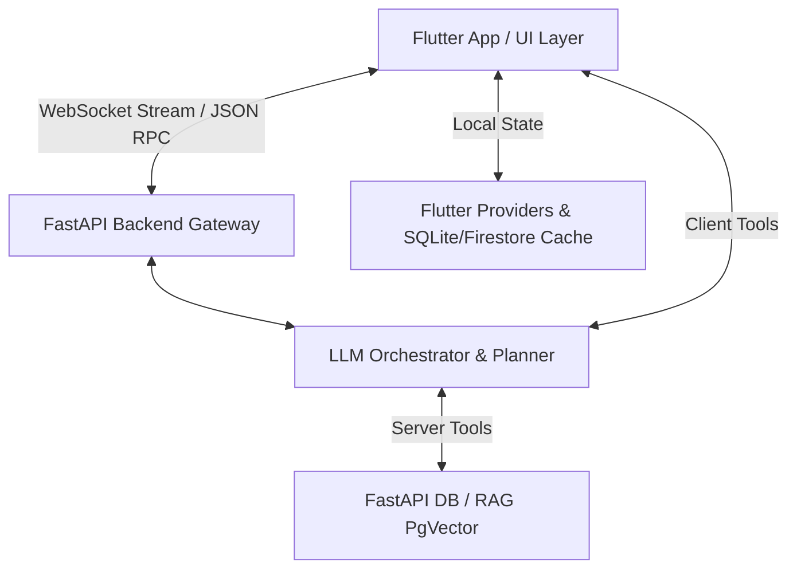

# 01. Tổng Quan Kiến Trúc (Architecture Overview)

## 🏗️ Kiến Trúc Hệ Thống (System Architecture)

Hệ thống **AI Health Chatbot & HealthApp** được thiết kế theo kiến trúc **Clean Architecture** kết hợp hệ thống đa đại lý (Multi-Agent System) và cơ chế đồng bộ 2 chiều thời gian thực qua WebSocket.

---

## 🧩 Các Tầng Kiến Trúc (Architectural Layers)

### 1. Presentation & State Management Layer (Flutter Client)
- **Framework**: Flutter (Dart), Type-safe, Responsive Layout.
- **State Management**: `Provider` (`ChangeNotifierProxyProvider`).
- **Real-time Engine**: `AIChatProvider` kết nối qua WebSocket Channel.
- **UI Components**:
  - `ChatbotScreen`: Màn hình trò chuyện chính với hiệu ứng streaming từng từ (word-by-word streaming).
  - `FloatingChatBubble`: Trợ lý AI dạng bong bóng nổi (FAB) truy cập tức thì từ mọi tab.
  - `ProactiveCheckinCard`: Thẻ AI Health Nudge thông minh trên Dashboard tự động phát hiện và gợi ý thiếu hụt chỉ số sức khỏe.

### 2. Service & Gateway Layer (FastAPI AI Backend)
- **Framework**: FastAPI (Python, `async/await`, Pydantic).
- **Core Components**:
  - `AgentOrchestrator`: Quản lý luồng giao tiếp với LLM, giới hạn context window (6 lượt gần nhất) để tối ưu độ trễ.
  - `ToolDispatcher` & `ToolRegistry`: Quản lý 15 Client Tools (Flutter-side) và các Server Tools (Dish, Workout, TDEE, RAG, Plan creation).
  - `DbSessionStore`: Lưu trữ phiên trò chuyện, lịch sử tin nhắn và nhật ký Nudge.
  - `ProactiveService`: Đánh giá sức khỏe và gửi gợi ý chủ động.

### 3. Data & RAG Layer (Database Systems)
- **Relational DB**: PostgreSQL với SQLAlchemy Async.
- **Vector DB**: `pgvector` lưu trữ embeddings kiến thức dinh dưỡng và y học Việt Nam.
- **Cache**: Local JSON & `NutritionCacheService` phía Flutter giúp xử lý Optimistic UI mà không block giao diện.

---

## 🔄 Luồng Dữ Liệu 2 Chiều (2-Way Data Flow)

1. **User Input -> AI Agent**: Người dùng gửi yêu cầu từ `ChatbotScreen` hoặc `FloatingChatBubble`.
2. **Intent Analysis & Tool Selection**: LLM phân tích ý định và phát lệnh `tool_call` (ví dụ: `get_active_plan`, `log_meal`, `mark_plan_item_complete`).
3. **Client Tool Interception**: `AIChatProvider` trên Flutter nhận `tool_call` qua WebSocket, thực thi với `BackendApiService` hoặc Local Providers (`NutritionProvider`, `ExerciseProvider`, `HealthProvider`).
4. **Optimistic UI & DB Persistence**: Dữ liệu được ghi ngay vào DB backend và gọi `notifyListeners()`, giúp các tab Dinh dưỡng, Vận động và Tổng quan cập nhật thời gian thực.
5. **Tool Result Callback**: Flutter gửi `tool_result` về Backend, LLM tiếp tục tạo câu trả lời tự nhiên dạng streaming cho người dùng.

---

## ⚡ Tối Ưu Độ Trễ & Hiệu Năng (Latency Optimization Benchmarks)

1. **Parallel Tool Calling**: Hệ thống ép LLM phát tất cả các lệnh `tool_call` đọc dữ liệu trong đúng 1 lượt ReAct duy nhất thay vì gọi nối tiếp.
2. **Strict Step Limit**: Cấu hình `max_agent_steps = 3` tối đa 3 vòng lặp ReAct cho 1 câu hỏi, giúp ngăn chặn lặp vô tận.
3. **Client Tool Timeout**: Đặt `tool_timeout_ms = 5000` (5.0 giây) cho các tool client-side qua WebSocket.
4. **Fast RAG Query Timeout**: Giới hạn thời gian truy vấn pgvector RAG trong `asyncio.wait_for(..., timeout=1.0s)` để đảm bảo embedding vector search không làm chậm câu trả lời.
