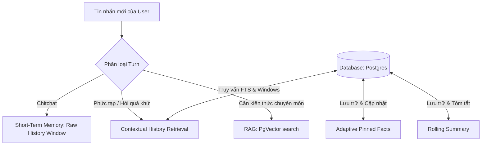

# 03. Chi Tiết Tính Năng: Hệ Thống Bộ Nhớ Chatbot (Chatbot Memory System)

Hệ thống bộ nhớ của chatbot được thiết kế để duy trì ngữ cảnh nhất quán và cá nhân hóa trải nghiệm người dùng trong các cuộc hội thoại dài hơi mà không làm quá tải Context Window của LLM.

---

## 🏗️ Kiến Trúc Bộ Nhớ Đa Tầng (Multi-Tier Memory Architecture)

Hệ thống tích hợp 4 kỹ thuật quản lý bộ nhớ cốt lõi:



### 1. Bộ Nhớ Ngắn Hạn (Short-Term / Working Memory)
- **Raw History Window:** Chatbot lưu và gửi trực tiếp các lượt hội thoại gần nhất (`settings.max_history_turns` = 24) vào prompt của LLM để duy trì mạch hội thoại trực tiếp.

### 2. Tóm Tắt Ngữ Cảnh (Summary Memory)
- **Rolling Summary:** Khi cuộc trò chuyện vượt quá `summary_threshold` (20 turns), một tiến trình nền (`updateRollingSummary`) sẽ tự động tóm tắt các lượt hội thoại cũ thành một đoạn văn ngắn gọn, cập nhật vào bảng `chat_session_memory`.

### 3. Bộ Nhớ Lâu Dài Thích Ứng (Adaptive Pinned Facts / Long-Term Memory)
- **State Machine Pinned Facts:** AI tự động phân tích và trích xuất các thông tin sức khỏe ổn định lâu dài (dị ứng, sở thích, mục tiêu) của user.
- **Adaptive Memory State Updates:** AI đối chiếu các turn mới với danh sách sự thật đã biết để đưa ra các hành động cập nhật động:
  - `add`: Thêm sự thật mới chưa từng có.
  - `update`: Cập nhật sự thật cũ bằng thông tin mới chính xác hơn (đánh dấu sự thật cũ là `rejected` và chèn sự thật mới).
  - `remove`: Loại bỏ sự thật cũ không còn đúng (đánh dấu sự thật cũ là `rejected`).
  Điều này giúp giải quyết triệt để tình trạng xung đột thông tin (ví dụ: mục tiêu cân nặng thay đổi).

### 4. Truy Xuất Ngữ Cảnh Dài Hạn (Contextual Window Memory Retrieval)
- **Contextual Search:** Khi người dùng hỏi về các sự kiện hoặc cuộc trò chuyện trong quá khứ, hệ thống sẽ thực hiện Full-Text Search (FTS) trên Postgres để tìm các tin nhắn khớp từ khóa.
- **Dialogue Blocks:** Từ mỗi tin nhắn khớp, hệ thống sử dụng Postgres Window Function (`ROW_NUMBER()`) để kéo thêm **2 tin nhắn trước và 2 tin nhắn sau nó** nhằm tái cấu trúc trọn vẹn ngữ cảnh đối thoại.
- **Overlapping Merge:** Tự động gộp (merge) các block đối thoại trùng lặp và loại bỏ các tin nhắn đã có sẵn trong cửa sổ lịch sử ngắn hạn trượt, giúp tối ưu không gian nhập liệu.

---

## 🛠️ Chi Tiết Triển Khai Trong Code

### 1. Truy xuất cửa sổ ngữ cảnh (Postgres FTS & Window Function)
Được triển khai trong `MemoryService._search_contextual_history`:
```sql
WITH numbered AS (
    SELECT id, session_id, role, content, tool_call_id, tool_name, created_at,
           ROW_NUMBER() OVER (ORDER BY created_at ASC, id ASC) as rn
    FROM chat_messages
    WHERE session_id = :sid
),
matches AS (
    SELECT rn 
    FROM numbered 
    WHERE to_tsvector('simple', content) @@ websearch_to_tsquery('simple', :query)
)
SELECT DISTINCT n.id, n.session_id, n.role, n.content, n.tool_call_id, n.tool_name, n.created_at, n.rn
FROM numbered n
JOIN matches m ON n.rn >= m.rn - 2 AND n.rn <= m.rn + 2
ORDER BY n.rn ASC
LIMIT :lim;
```

### 2. Trình trích xuất sự thật thích ứng (Adaptive Fact Extractor)
Được triển khai trong `buildFactExtractionPrompt` và xử lý trong `updateRollingSummary` của `memory_service.py` để định hướng hành vi của mô hình qua định dạng JSON có cấu trúc gồm: `action` (`add|update|remove`), `fact` (nội dung mới), `target_fact` (nội dung cũ cần sửa đổi/xóa), và `confidence`.
